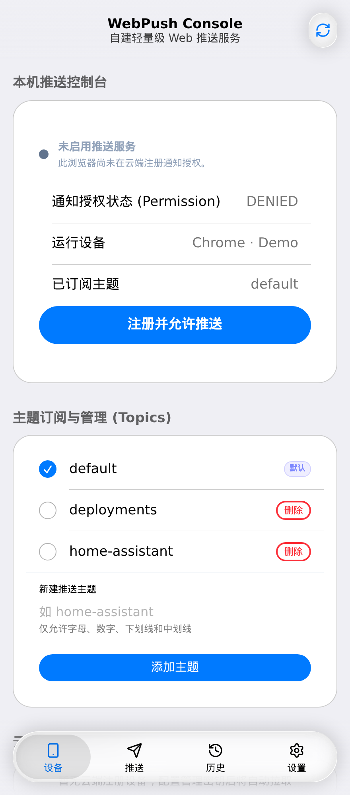
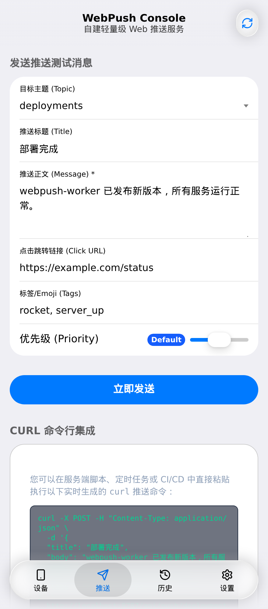
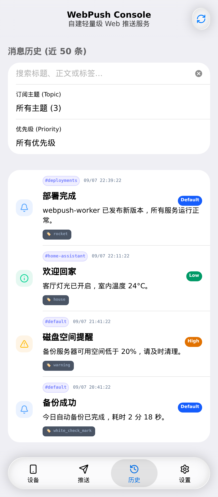
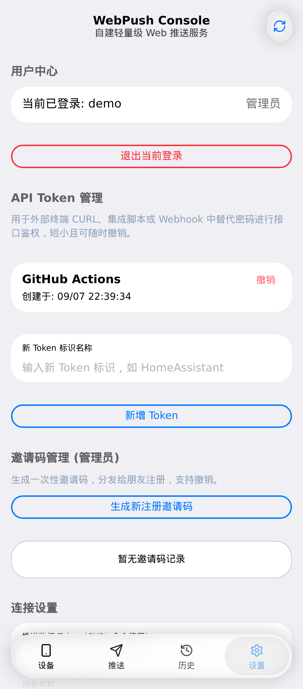

<p align="center">
  
</p>

# webpush-worker

A lightweight, self-hosted Web Push service with a PWA console.

## Screenshots

Device management, push messages, notification history, and account settings. Captured from the running app with a local demo account; history entries are sample data.

| Devices & topics | Send a push message |
| --- | --- |
|  |  |

| Notification history | Settings |
| --- | --- |
|  |  |

## Development

To install dependencies:

```bash
pnpm install
```

To start the API and PWA development servers:

```bash
pnpm dev
```

Requirements: Node.js 26 and pnpm 12.
